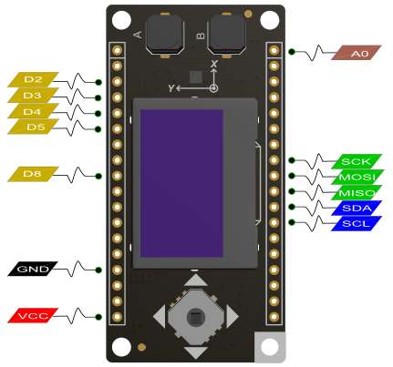

# DFRobot_OLED12864
* [中文版](./README_CN.md)

This is a driver for the SSD1306 based on 128x64 pixel OLED display running on the Arduino/ESP8266 platform. Can be used with either the I2C or SPI version of the display.

The Ui Library is used to provide a basic set of Ui elements called, 'Frames' and 'Overlays'. A 'Frame' is used to provide
information the default behaviour is to display a 'Frame' for a defined time and than move to the next. The library also provides an 'Indicator' that will be updated accordingly. An 'Overlay' on the other hand is a pieces of information (e.g. a clock) that is displayed always at the same position.



> Please have a look at our [upgrade guide](UPGRADE.md)


Referring to (https://github.com/squix78/esp8266-oled-ssd1306) of squix78 at here, thanks for info and resource shared of squix78!

Some exceptional cool modules has been added to FireBeetle ESP Baords-DFR.Such as BMA220, BME280 and multilanguage character chips(Support Chinese now, still updating), one 5 directions switch and 2 digital keys.

Note: Please download BME280 Arduino library first when use Humidity & Temperature sensors (https://github.com/DFRobot/DFRobot_BME280).

For more questions or interesting projects, you can visit the [forum](https://www.dfrobot.com/)!


## Product Link (https://www.dfrobot.com/product-1744.html)
    SKU: DFR0507


## Table of Contents

* [Summary](#summary)
* [Installation](#installation)
* [Methods](#methods)
* [Compatibility](#compatibility)
* [History](#history)
* [Credits](#credits)


## Summary

* Draw pixels at given coordinates
* Draw lines from given coordinates to given coordinates
* Draw or fill a rectangle with given dimensions
* Draw Text at given coordinates:
 * Define Alignment: Left, Right and Center
 * Set the Fontface you want to use (see section Fonts below)
 * Limit the width of the text by an amount of pixels. Before this widths will be reached, the renderer will wrap the text to a new line if possible
* Display content in automatically side scrolling carousel
 * Define transition cycles
 * Define how long one frame will be displayed
 * Draw the different frames in callback methods
 * One indicator per frame will be automatically displayed. The active frame will be displayed from inactive once


## Installation

There two methods:

1. To use this library, first download the library file, paste it into the \Arduino\libraries directory, then open the examples folder and run the demo in the folder.
2. Search the DFRobot_OLED12864 library from the Arduino Software Library Manager and download it.


## Methods

## I2C with Wire.h

```C++
#include <Wire.h>  
#include "DFRobot_OLED12864.h"

DFRobot_OLED12864  display(ADDRESS, PIN_CHARACTER_CS);

```

## Display Control

```C++
/*
 * @brief OLED init
 */
void init(void);

/*
 * @brief free the memory used by the display
 */
void end(void);

/*
 * @brief cycle through the initialization
 */
void resetDisplay(void);

/*
 * @brief connect again to the display through I2C
 */
void reconnect(void);

/*
 * @brief turn the display on
 */
void displayOn(void);

/*
 * @brief turn the display off
 */
void displayOff(void);

/*
 * @brief clear the local pixel buffer
 */
void clear(void);

/*
 * @brief write the buffer to the display memory
 */
void display(void);

/*
 * @brief inverted display mode
 */
void invertDisplay(void);

/*
 * @brief normal display mode
 */
void normalDisplay(void);

/*
 * @brief set display contrast
 *
 * @param contrast from 0 to 255
 */
void setContrast(char contrast);

/*
 * @brief turn the display upside down
 */
void flipScreenVertically(void);

/*
 * @brief display string
 *
 * @param x from 0 to 127
 * @param y from 0 to 63
 * @param *ch The string you want to show (use character IC)
 */
void disStr(uint8_t x, uint8_t y, char *ch);
```

## Pixel drawing

```C++

/* Drawing functions */

/*
 * @brief sets the color of all pixel operations
 *
 * @param color to display
 *     BLACK        display main color to black
 *     WHITE        display main color to white
 *     INVERSE      display to inverse
 */
void setColor(OLEDDISPLAY_COLOR color);

/*
 * @brief draw a pixel at given position
 *
 * @param x from 0 to 127
 * @param y from 0 to 63
 */
void setPixel(int16_t x, int16_t y);

/*
 * @brief draw a line from position (x0, y0) to position (x1, y1)
 *
 * @param x0 from 0 to 127
 * @param y0 from 0 to 63
 * @param x1 from 0 to 127
 * @param y1 from 0 to 63
 */
void drawLine(int16_t x0, int16_t y0, int16_t x1, int16_t y1);

/*
 * @brief draw the border of a rectangle at the given location
 *
 * @param x from 0 to 127
 * @param y from 0 to 63
 * @param width from 0 to 127
 * @param height from 0 to 63
 */
void drawRect(int16_t x, int16_t y, int16_t width, int16_t height);

/*
 * @brief fill the rectangle at the given location
 *
 * @param x from 0 to 127
 * @param y from 0 to 63
 * @param width from 0 to 127
 * @param height from 0 to 63
 */
void fillRect(int16_t x, int16_t y, int16_t width, int16_t height);

/*
 * @brief draw the border of a circle
 *
 * @param x from 0 to 127
 * @param y from 0 to 63
 * @param radius from 0 to 64
 */
void drawCircle(int16_t x, int16_t y, int16_t radius);

/*
 * @brief fill circle
 *
 * @param x from 0 to 127
 * @param y from 0 to 63
 * @param radius from 0 to 64
 */
void fillCircle(int16_t x, int16_t y, int16_t radius);

/*
 * @brief draw a line horizontally at the given location
 *
 * @param x from 0 to 127
 * @param y from 0 to 63
 * @param length from 0 to 127
 */
void drawHorizontalLine(int16_t x, int16_t y, int16_t length);

/*
 * @brief draw a lin vertically at the given location
 *
 * @param x from 0 to 127
 * @param y from 0 to 63
 * @param length from 0 to 63
 */
void drawVerticalLine(int16_t x, int16_t y, int16_t length);

/*
 * @brief draw a lin vertically at the given location
 *
 * @param x from 0 to 127
 * @param y from 0 to 63
 * @param width from 0 to 127
 * @param height from 0 to 63
 * @param progress from 0 to 100
 */
void drawProgressBar(uint16_t x, uint16_t y, uint16_t width, uint16_t height, uint8_t progress);

/*
 * @brief draw a bitmap in the internal image format
 *
 * @param x from 0 to 127
 * @param y from 0 to 63
 * @param width from 0 to 127
 * @param height from 0 to 63
 * @param *image image data
 */
void drawFastImage(int16_t x, int16_t y, int16_t width, int16_t height, const char *image);

/*
 * @brief draw a XBM
 *
 * @param x from 0 to 127
 * @param y from 0 to 63
 * @param width from 0 to 127
 * @param height from 0 to 63
 * @param *xbm xbm data
 */
void drawXbm(int16_t x, int16_t y, int16_t width, int16_t height, const char* xbm);
```

## Text operations

``` C++

/*
 * @brief draw string at the given location
 *
 * @param x from 0 to 127
 * @param y from 0 to 63
 * @param text you want to show (don't use character IC)
 */
void drawString(int16_t x, int16_t y, String text);

/*
 * @brief Draws a String with a maximum width at the given location.
 *        If the given String is wider than the specified width
 *        The text will be wrapped to the next line at a space or dash
 *
 * @param x from 0 to 127
 * @param y from 0 to 63
 * @param maxLineWidth max line width
 * @param text you want to show (don't use character IC)
 */
void drawStringMaxWidth(int16_t x, int16_t y, int16_t maxLineWidth, String text);

/*
 * @brief return string length on OLED(uint pixel)
 *
 * @param test text
 * @param length text length
 */
uint16_t getStringWidth(const char* text, uint16_t length);

/*
 * @brief return string length on OLED(uint pixel)
 *
 * @param test text
 */
uint16_t getStringWidth(String text);

/*
 * @brief specifies relative to which anchor point
 *
 * @param text alignment
 *      TEXT_ALIGN_LEFT, TEXT_ALIGN_CENTER, TEXT_ALIGN_RIGHT, TEXT_ALIGN_CENTER_BOTH
 */
void setTextAlignment(OLEDDISPLAY_TEXT_ALIGNMENT textAlignment);

/*
 * @brief Sets the current font. Available default fonts
 *
 * @param fontData font data
 *      ArialMT_Plain_10, ArialMT_Plain_16, ArialMT_Plain_24
 */
void setFont(const char* fontData);

```

## Ui Library (OLEDDisplayUi)

```C++
/*
 * @brief initialise the display
 */
void init(void);

/*
 * @brief configure the internal used target FPS
 *
 * @param fps from 0 to 255
 */
void setTargetFPS(uint8_t fps);

/*
 * @brief enable automatic transition to next frame after the some time can be configured with
 *     `setTimePerFrame` and `setTimePerTransition`.
 */
void enableAutoTransition(void);

/*
 * @brief disable automatic transition to next frame.
 */
void disableAutoTransition(void);

/*
 * @brief set the direction if the automatic transitioning
 */
void setAutoTransitionForwards(void);
void setAutoTransitionBackwards(void);

/*
 * @brief set the approx. time a frame is displayed
 *
 * @param time time (unit ms)
 */
void setTimePerFrame(uint16_t time);

/*
 * @brief set the approx. time a transition will take
 *
 * @param time time (unit ms)
 */
void setTimePerTransition(uint16_t time);

/*
 * @brief draw the indicator.
 *    This is the default state for all frames if
 *    the indicator was hidden on the previous frame
 *    it will be slided in.
 */
void enableIndicator(void);

/*
 * @brief don't draw the indicator.
 *    This will slide out the indicator
 *    when transitioning to the next frame.
 */
void disableIndicator(void);

/*
 * @brief enable drawing of all indicators.
 */
void enableAllIndicators(void);

/*
 * @brief disable drawing of all indicators.
 */
void disableAllIndicators(void);

/*
 * @brief set the position of the indicator bar.
 *
 * @param pos indicator pos
 *     BOOTM, TOP, RIGHT, LEFT
 */
void setIndicatorPosition(IndicatorPosition pos);

/*
 * @brief set the direction of the indicator bar. Defining the order of frames ASCENDING / DESCENDING
 *
 * @param dir indicator dirction
 *     LEFT_RIGHT, RIGHT_LEFT
 */
void setIndicatorDirection(IndicatorDirection dir);

/*
 * @brief set the symbol to indicate an active frame in the indicator bar.
 *
 * @param symbol active symbol
 *     ANIMATION_activeSymbol
 */
void setActiveSymbol(const char* symbol);

/*
 * @brief set the symbol to indicate an inactive frame in the indicator bar.
 *
 * @param symbol inactive symbol
 *     ANIMATION_inactiveSymbol
 */
void setInactiveSymbol(const char* symbol);

/*
 * @brief configure what animation is used to transition from one frame to another
 *
 * @param dir frame animation dirction
 *     SLIDE_UP, SLIDE_DOWN, SLIDE_LEFT, SLIDE_RIGHT
 */
void setFrameAnimation(AnimationDirection dir);

/*
 * @brief add frame drawing functions
 *
 * @param frameFunctions your frame functions
 * @param frameCount your frames count
 */
void setFrames(FrameCallback* frameFunctions, uint8_t frameCount);

/*
 * @brief add overlays drawing functions that are draw independent of the Frames
 *
 * @param overlayFunctions your overlay function
 * @param overlayCount your overlays count
 */
void setOverlays(OverlayCallback* overlayFunctions, uint8_t overlayCount);

/*
 * @brief set the function that will draw each step
 *     in the loading animation
 *
 * @param loadingDrawFunction load your function
 */
void setLoadingDrawFunction(LoadingDrawFunction loadingDrawFunction);

/*
 * @brief run the loading process
 *
 * @param *stages your stages
 * @param stagesCount your stages count
 */
void runLoadingProcess(LoadingStage* stages, uint8_t stagesCount);

/*
 * @brief manuell Controll
 */
void nextFrame(void);
void previousFrame(void);

/*
 * @brief switch without transition to frame `frame`.
 *
 * @param frame select next frame
 */
void switchToFrame(uint8_t frame);

/*
 * @brief transition to frame `frame`, when the `frame` number is bigger than the current
 *    frame the forward animation will be used, otherwise the backwards animation is used.
 *
 * @param frame the frame you want to show
 */
void transitionToFrame(uint8_t frame);

/*
 * @brief return display info
 */
OLEDDisplayUiState* getUiState(void);

/*
 * @brief This needs to be called in the main loop
 *     the returned value is the remaining time (in ms)
 *     you have to draw after drawing to keep the frame budget.
 */
int8_t update(void);

```


## Compatibility

MCU                | Work Well    | Work Wrong   | Untested    | Remarks
------------------ | :----------: | :----------: | :---------: | :----:
FireBeetle-ESP8266 |      √       |              |             |
FireBeetle-ESP32   |      √       |              |             |
FireBeetle-BLE4.1  |              |       √      |             |


## History

- 2022/04/02 - Version 1.0.0 released.


## Credits

Written by qsjhyy(yihuan.huang@dfrobot.com), 2022. (Welcome to our [website](https://www.dfrobot.com/))

